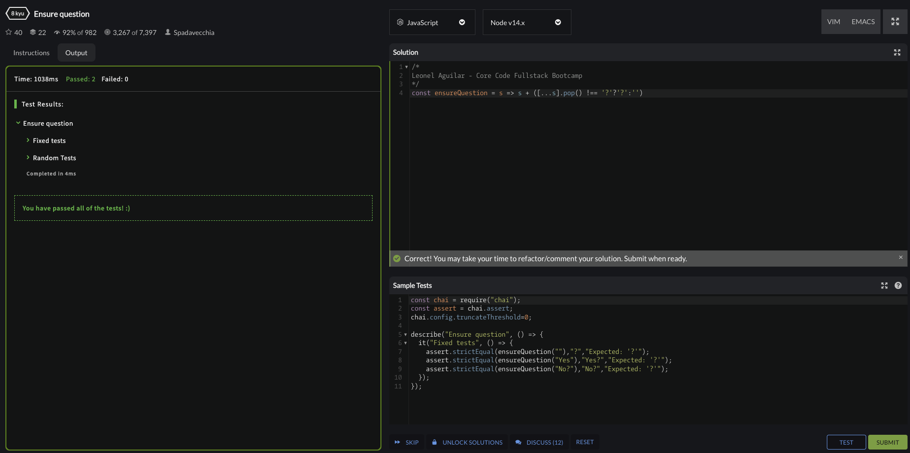
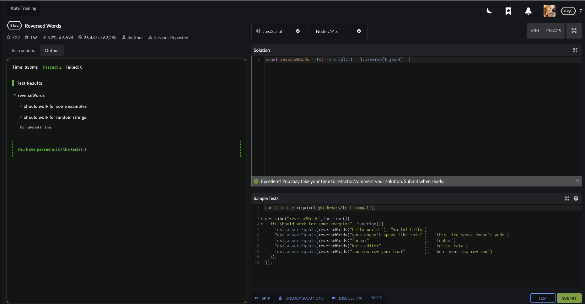
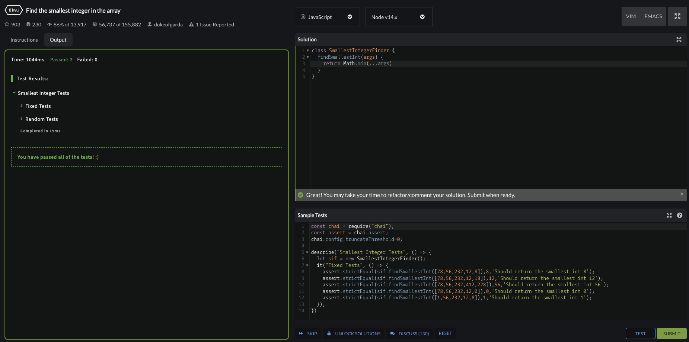
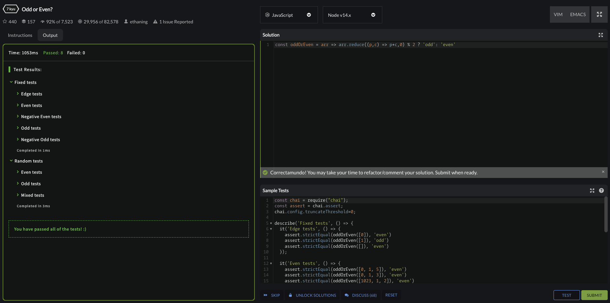

# Ensure question

## Solution

```js 
/*
Leonel Aguilar - Core Code Fullstack Bootcamp
*/
const ensureQuestion = s => s + ([...s].pop() !== '?'?'?':'')
```

## Screenshot



# Reversed words

## Solution

```js
const reverseWords = (s) => s.split(' ').reverse().join(' ')
```

## Screenshot



# Smallest integer

## Solution

```js
class SmallestIntegerFinder {
  findSmallestInt(args) {
    return Math.min(...args)
  }
}
```

## Screenshot


# Odd or even

## Solution

```js
const oddOrEven = arr => arr.reduce((p,c) => p+c,0) % 2 ? 'odd': 'even'
```

## Screenshot
